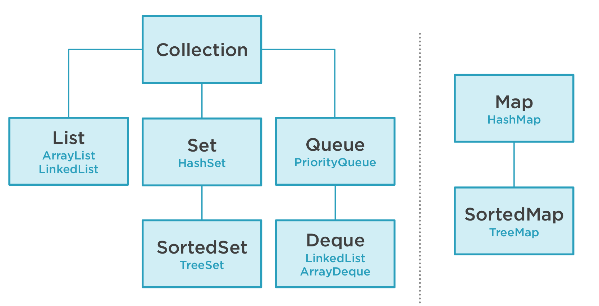

# JAVA_COLLECTIONS

# Context application

Apres avoir recupere le projet et l'avoir construit a l'aide de gradle, lisons le code.

Pour chaque module etudie deux packages existent, une trame (before) suivi d'une correction (after).


L'application,

Declare de nouveaux produits, les produits ont les attributs nom et poids.

Le but vas t'etre d'implementer les methodes permettant de:

* Creer un tableau contenant ces produits

```java
Product[] products = {door, floorPanel};
```

* Ecrire dans la console le tableau de produit

```java
System.out.println(products);
// retourne [Lcom.monotonic.collections.common.Product;@78308db1
```

* Ajouter un produit au tableau
* Dupliquer ce produit dans le tableau


# Le probleme des Array

**Inconvenient des Arrays**

* **1er** Les Arrays ne sont pas facile a afficher dans la console car retourne uniquement le type d'objet contenu dedans ainsi que l'adresse memoire, rien de plus.

```cmd
[Lcom.monotonic.collections.common.Product;@78308db1].
```

Pour remedier a cela nous pouvons utiliser la methode toString de la class Arrays pour afficher sont contenu:


```java
System.out.println(Arrays.toString(products));

```

>**Arrays.toString(tableau [] en parametre)** ==> Retourne les chaine de caractere contenu dans un tableau

* **2eme** Si on declare un tableau de deux index contenant deux string et que l'on y ajoute un troisieme element lors JVM nous retourne l'exception ArrayIndexOutOfBoundsException:

```cmd
Exception in thread "main" java.lang.ArrayIndexOutOfBoundsException: Index 2 out of bounds for length 2
	at com.monotonic.collections._2_what_are_collections.before.TheArrayProblem.main(TheArrayProblem.java:20)
```

Pour y remedier, nous allons creer une methode d'ajout, qui nous retournera un tableau contenant des Produits et prendra en parametre, un produit (celui a ajouter) et un tableau de Produits (ici le tableau de longeur 2).

Nous y declarons (dans la methode d'ajout) :

* une variable int length representant la longueur du tableau (ici 2)
* une variable newArray de type Produit initialise a l'aide de la methode copy de la class Arrays (Arrays.copy), permettant de copier le tableau actuel et y ajouter un indexe (length +1)

Puis nous utilisons l'index de ce nouveau tableau (ici: 2+1=3) pour y affecter le nouveau produit (ici : windows (passe en parametre)

Et enfin retournons le nouveau tableau:


```java

products=add(window, products);

private static Product[] add(Product product, Product[] array)
{
    int length = array.length;
    Product[] newArray = Arrays.copyOf(array, length + 1);
    newArray[length] = product;
    return newArray;
}

// retourne 
[Product{name='Porte en bois', weight=35}, Product{name='Panneau de plancher', weight=25}, Product{name='Fenetre', weight=10}]

```

* **3eme** Si l'on souhaite reiterer l'operation d'ajout alors nous repetons products = add(window, products), se qui n'est pas une bonne pratique, et n'est pas flexible.


**LES COLLECTIONS SONT LA SOLUTIONS DE NOS PROBLEME D'ARRAYS**

# Les Collections




Vert: oui

Rouge: non


La class collections extends iterable, se qui lui permet d'iterer sur tous les elements de la collection.

Quelques methodes de la classe Collections:

* size() ==> Renvoie le nombre d'elements de cette collection.
* isEmpty() ==> Renvoie true si cette collection ne contient aucun element.
* add() ==> Garantit que cette collection contient l'element specifie.
* addAll() ==> Ajoute tous les elements de la collection specifiee à cette collection.
* remove(element) ==> Supprime une seule instance de l'element specifie de cette collection, si elle est presente.
* removeAll(Collection) ==> Supprime tous les elements de cette collection qui sont egalement contenus dans la collection specifiee
* retain(Collection) ==> Conserve uniquement les elements de cette collection qui sont contenus dans la collection specifiee
* contains(element) ==> Renvoie true si cette collection contient l'element specifie.
* containAll(collection) ==> Renvoie true si cette collection contient tous les elements de la collection specifiee.
* clear() ==> Supprime tous les elements de cette collection.


# Les Lists: collections avec ordre d'iteration


# Les Maps: Collections avec pairs (cle/ valeur)


# Les Streams


# Les operations et fabriques de Collections


# Les Sets: Collection avec unicite


